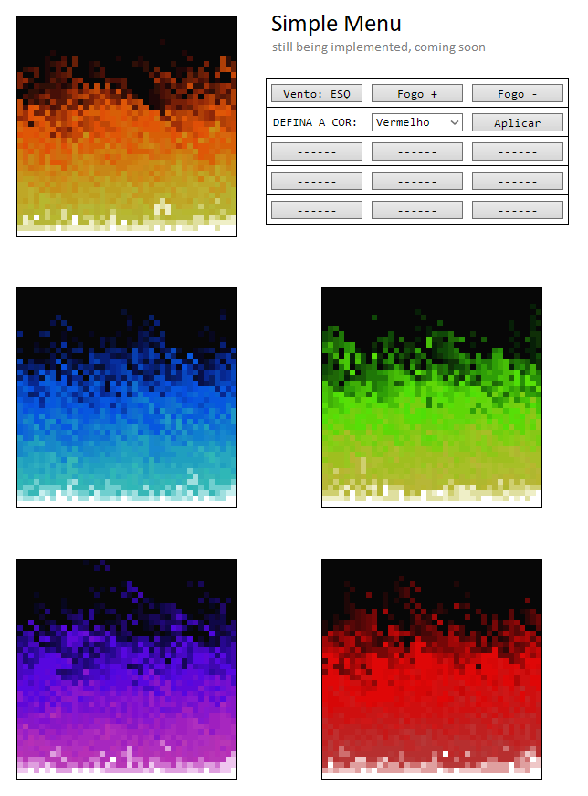

# DOOM FIRE ALGORITHM

### <a href="https://filipe-bacof.github.io/Domm-Fire-Deschamps/projeto%20limpo/index.html">GREEN DOOM FIRE<a/>

  

This algorithm is a canvas, an html table. JavaScript creates the data structure, then updates the fire intensity values on the canvas, and finally renders it in colors, and throws it into the HTML.

I'm creating a way to change the values in the code, like the wind direction, the fire colors (which can be auto generated, all the spectrum colors, and some custom ones), or also the fire size for example.

# See some examples of fires that were created:

### <a href="https://www.youtube.com/c/FilipeDeschamps/">FILIPE DESCHAMPS YOUTUBE CHANNEL<a/>
#### <a href="https://www.youtube.com/watch?v=HCjDjsHPOco&t=593s">Implementation + Introduction Video<a/>
#### <a href="https://www.youtube.com/watch?v=fxm8cadCqbs">Tutorial Doom Fire Algorithm<a/>
#### <a href="https://github.com/filipedeschamps/doom-fire-algorithm">Filipe Deschamps GitHub Repository<a/>
